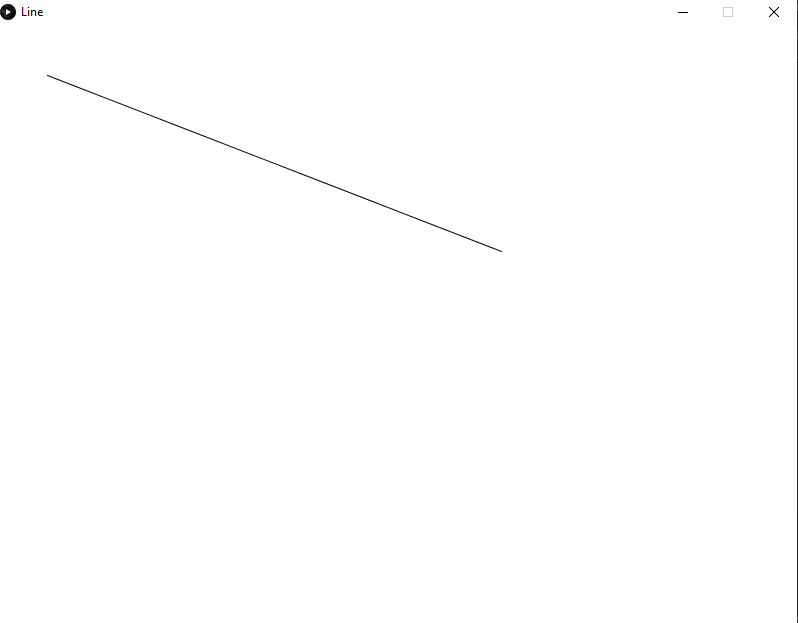

# Line

Line is a Processing Class that draws a single Line that can be resized by mouse clicking a single time and moving your mouse



## How to use

You just need to move your mouse near to the beginning or end of the line. If you can see a circle in the beginning or the end it means you can click and move to modify the line. Click a second time if you want to stop resizing the line

## Installation

1. Download and Install [Processing 3.x](https://processing.org/download) stable release
2. Download and Install [Java SE 8.x](https://www.oracle.com/technetwork/es/java/javase/downloads/index.htm)
3. Download the last version of Line using GitHub clone button or...

If you have git command line installed in your PC you can use

```bash
git clone https://github.com/LuisFer666/Line.git
```

If you have GitHub command line installed in your PC you can use

```bash
gh repo clone LuisFer666/Line
```

4. Build and run this project

You can create instances of Grafica class in your own project
